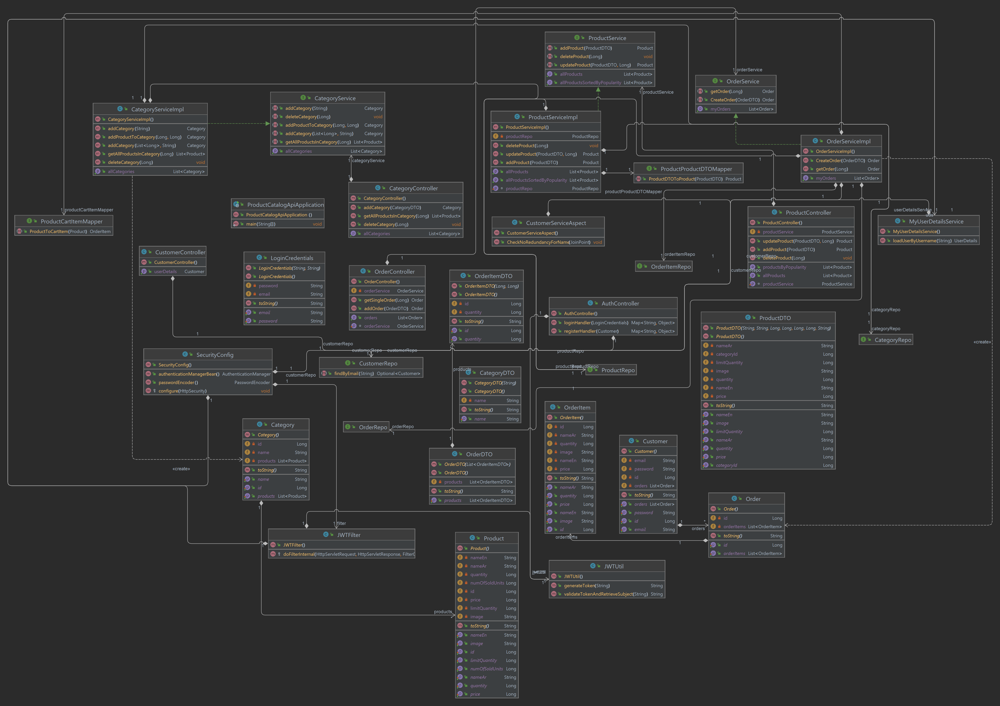
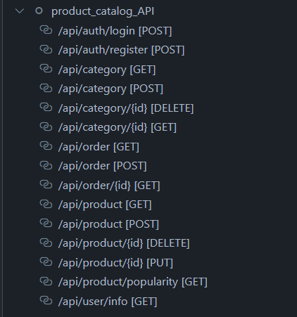

# 📦 Product Catalog API  
_A RESTful API for managing product catalogs, including categories, products, and variants._  

  

## 🚀 Getting Started  

### 1️⃣ Installation  
Clone the repository and install dependencies:  
```sh
git clone https://github.com/munyaneza-w/Product-Catalog-API.git
cd Product-Catalog-API
npm install
```

### 2️⃣ Running the Server  
Start the development server:  
```sh
npm start
```
Product Catalog API runs on: `http://localhost:3001`

---

## 📜 API Documentation  
Swagger documentation is available at:  
[http://localhost:3001/api-docs](http://localhost:3001/api-docs)  

You can explore available endpoints, parameters, and response formats.

---

## 📌 Key Features  

✅ **Product Management** - CRUD operations for products  
✅ **Category Management** - Organize products into categories  
✅ **Search & Filtering** - Search by name, category, price, etc.  
✅ **Inventory Tracking** - Monitor stock levels  
✅ **Swagger Documentation** - Interactive API docs  

---

## 🔥 Endpoints Overview  

## System Architecture

### Entity Relationship Diagram  


### Class Diagram  


### API Endpoints  



### **Products**  
| Method | Endpoint          | Description                     |
|--------|------------------|---------------------------------|
| GET    | `/api/products`  | Fetch all products             |
| POST   | `/api/products`  | Add a new product              |
| GET    | `/api/products/:id` | Get a product by ID           |
| PUT    | `/api/products/:id` | Update a product              |
| DELETE | `/api/products/:id` | Remove a product              |

### **Categories**  
| Method | Endpoint           | Description                  |
|--------|-------------------|------------------------------|
| GET    | `/api/categories` | Get all categories           |
| POST   | `/api/categories` | Create a new category        |

---

## 📌 Example Request  

### Fetching Products
```sh
GET /api/products?search=gaming&minPrice=50&maxPrice=200&category=electronics
```
📌 **Example JSON Response**  
```json
[
  {
    "id": 1,
    "name": "Gaming Mouse",
    "category": "Electronics",
    "price": 59.99,
    "stock": 100
  }
]
```

---

## 🛠 Technologies Used  
- **Node.js** & **Express.js** - Backend framework  
- **MongoDB** (or SQL alternative) - Database  
- **Swagger** - API documentation  

---

## 📖 License  
This project is licensed under the MIT License. See [LICENSE](LICENSE) for details.

---

## 🤝 Contributing  
Want to contribute? Follow these steps:  
1. Fork the repository  
2. Create a new branch (`git checkout -b feature-name`)  
3. Commit your changes (`git commit -m "Add feature"`)  
4. Push to your branch (`git push origin feature-name`)  
5. Open a Pull Request  

---

## 👤 Author  
**Wilson Munyaneza**  
🔗 [GitHub](https://github.com/munyaneza-w)  
